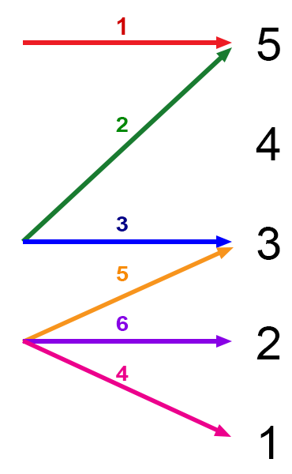

# Gods

- There are no traditional D&D4e gods
- The 12 Chinese Zodiacs are the “gods” of this world
- They are the source of Divine power
	- They expect their followers to embody their traits
	- Summary of their traits are [here](https://www.buildingbeautifulsouls.com/zodiac-signs/chinese-zodiac-signs-meanings/)

# Language

- No “common” languages apart from Common
	- Naming will be using the Cantonese tones
- Eladrin have a dialect (convenience called “Elvish”), which has spread into the world

# Machines

- There are no automatons (e.g. clockwork)
	- But mechanics and gadgets do
- Also therefore no Warforged at the start
