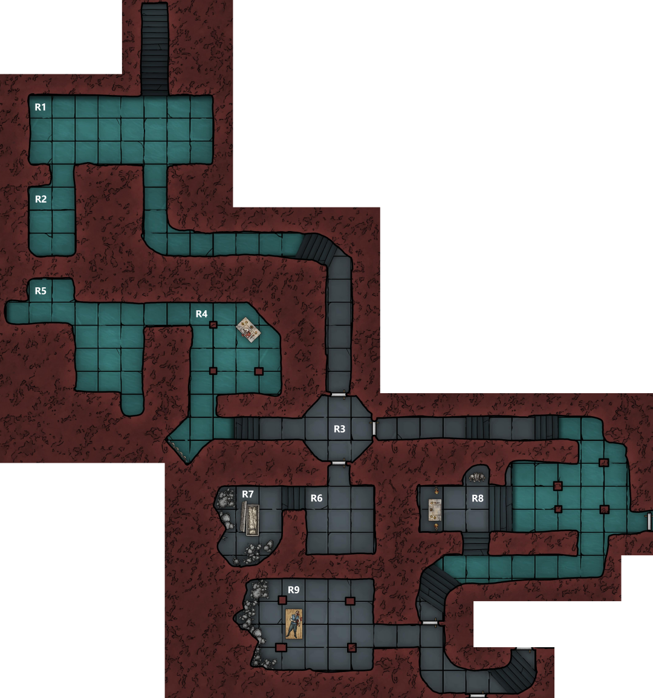

# The Bandiera Bath-house

- Opening the secret door in the bathhouse the party finds a set of stairs that go down into darkness, the stench of sewage rises from the passageway

Some torches are lit and Hayate and Marco cast light spells before descending the staircase
- At the bottom of the stairs is a limestone cave (R1) which has been artificially expanded
	- The 9ft high ceiling is supported by a number of wooden braces
- The cave is flooded with murky, foul smelling sewer water around 2ft deep

<!-- -->

- The party wades into the water, it’s slow going
- Investigating an exit to one side (R2), Hayate finds a cloakroom full of tatty cloaks, barely held above the water
- Strum grabs some cloaks in an attempt at disguise
- Eliseo scouts down the corridor from the other exit, heading up some stone steps and turning a corner before reaching a wooden door
	- Door is poorly fitting and doesn’t look very sturdy
	- Not seeing any light from the other side, he pushes the door open

Beyond the door is a small room (R3) with 3 further doors, the room is empty
- Each of these doors is carved with a life-size figure
	- Tall armoured man with a helmet, black right gauntlet, holding shackles (East)
	- Cloaked figure, face hidden under a cowl, skeletal hands holding a human skull, its eyes a fiery blue (South)
	- Powerfully built, skull headed man with blades for hands (West)
- Party debated the next course of action
- Hayate opens the door to the west, beyond is a short corridor which forks at the end

Heading along it he finds a tapestry in an alcove at the left fork
- Shows four naked, muscular, faceless figures ripping apart a fifth
- Looks very old and faded
- Marco joins him and begins sketching the tapestry

Continuing to the right Hayate finds a flooded room supported by 3 beams (R4)
- At the far end is a stone altar lit by candles
- On the altar is a pile of bloody entrails, possibly human
- Above the altar is a 3ft tall steel mask in the shape of a human skull
- On the wall, written in blood
	> Present to me your kill, so we may bathe in it’s blood and you will be rewarded

Marco follows Hayate into the room, investigating the altar he believes it to be magical and the bloody writing part of a ritual

Eliseo and Strum follow them, Strum gags at the sight of the altar

Beyond the altar room is another dark room (R5)
- Here Hayate and Marco find a corpse floating facedown in the water
- Human male, wearing leather armour, stabbed in the back
- Dead 1-2 days
- Hayate arranges the body in a death pose and closes its eyes and mouth
- Hayate and Marco discuss the corpse, wondering why it was not sacrificed

Seeing that this is a dead end the party returns to R3
- On the way Hayate goes to take a closer look at the tapestry
- As he reaches out to it he notices a yellow, spongy mold between it and the wall
- Decides to leave the tapestry alone

Vigil opens the southern door in R3
- Beyond is another small room (R6)
- There are 3 black robed bodies lying on the floor arranged in a triangle with a torch lying on the floor in the middle of the room
- Peering in at them he spots that they are breathing
- Signals to the rest of the party before charging into the room and bringing his flail down on one of the bodies
- The three cultists realise their ambush has failed and jump up to attack swinging flails made of human skulls with glowing blue eyes on the end of a chain
- They are quickly dispatched by the party

Investigating up the stairs Vigil finds a sarcophagus in R7
- Its open and filled with bones, clearly not just one bodies worth
- There is a lot of dust in the air, as if the bones were recently disturbed
- Looking amongst the bones he finds 3 books, opening them he can see they are full of arcane writing
	- Offers one to Hayate to look at
		- Identifies them as arcane spells, is disdainful of this sort of magic
		- Chucks the book to Marco
	- The other books are also given to Marco
- Hayate checks the bones
	- From many people
	- Of recent origin

Returning to R3 the party opens the door to the east
- Beyond is a long corridor
- Eliseo head down it to investigate
- He can hear whimpers of pain and a giggling sound
- There is a dim light at the end of the tunnel
- Vigil follows to bring the light
- Trips on a rock and stumbles, making a loud noise
- The sounds ahead stop

Eliseo darts into the room ahead (R8) and attempts to hide behind a wooden pillar
- The room is partially flooded, at the far end is a set of steps rising out of the water
- At the top there is an altar, shackled over the altar is a young man
	- In a loincloth and with a hempen bag over his head
- There are two figures standing near the altar
	- A man in chainmail with a bucket helmet (Iron consul), carrying a spear which he was clearly using to torture the man on the altar
	- Woman in chainmail with a shield and mace (Fist of Bane)
- They are both looking at Eliseo
	- The Iron consul shouts at his companion to get him

<!-- -->

- There is an exchange of arrow fire as the rest of the party rushes into the room, wading through the water as Hayate casts Bless
- The Iron consul charges into the water as the other fires a crossbow from the steps
- Vigil and Marco engage the Iron consul in melee with Strum supporting with lightning spells
- The Fist of Bane charges into the water and is intercepted by Hayate and Eliseo

<!-- -->

- The fight with the Iron consul is slow, both sides frustrated by the other’s armour
	- As blows are exchanged he catches Vigil’s flail
		- Vigil lets go and draws his sword, slashing him in one motion
	- Marco’s rapier is knocked from his hands and into the water
		- He draws his short sword and stabs under his guard
- Hayate and Eliseo bring down the Fist of Bane
	- Hayate goes to assist Marco and Vigil
- Eliseo heads up the steps to the altar
	- Takes the bag off his head
	- Has been beaten up and is bleeding
	- Picks the locks on his chains to free him
- Strum follows Eliseo and heals the prisoner as Marco finishes off the cultist

The prisoner thanks Eliseo for freeing him
- Eliseo recognises him as Dario Alfieri, the nephew of the high duke
- He praises the Almogavars but is disdainful of Marco’s group
- Dario wishes to leave immediately
- Strum and Eliseo escort him to the bathhouse where he promises a reward if they come and see him at his mansion in the upper city later

Whilst they are gone
- Hayate inspects the altar
	- Above it, written in blood
		> Present to me your prisoners and oppressed so that we might rule

- Vigil is unimpressed by the lack of courage shown by the local nobility
- He inspects a suit of plate mail standing in an alcove, it appears to be functional equipment, probably owned by the Iron consul
- It could be modified by a smith to fit him

The party heads south along a flooded corridor, up some stairs and through a door
- Hayate is leading and looking into R9
- Lit by candles
- Can see a shockingly thin woman wearing a robe standing behind a table
	- She is chanting and finishes a spell as he looks in
- Upon the table is a corpse which starts to move
- Below the table there is a swarming mass of skeletal and decomposing rats

<!-- -->

- The rat swarm rushes towards Hayate
- Marco rushes into the room after the woman and is followed by Vigil
- The woman casts Darkness, blacking out the far side of the room and covering Vigil, Marco and the zombie
	- The spell dispels the light spells cast by the party
- Strum rushes back to the last room to grab a torch
- Eliseo, Hayate, and Strum engage the undead rat swarm in the corridor
- Vigil and Marco struggle to fight the zombie whilst blind but Marco is eventually able to stab it through the head
- Whilst they are fighting they can feel blasts of energy narrowly missing them
- Hayate kills the last of the rats and the rest of the party enters the room
- Marco manages to find the witch in the darkness and stabs her, dropping the Darkness
- Party rushes her and quickly kills her but not before Hayate, Marco, and Vigil are caught in a wave of necrotic energy

With several injured members the party decides to take a rest
- Vigil uses the table to barricade the entrance

Searching the woman, a black, locked spell book is discovered
- Marco finds a key in her hair and uses it to unlock the book
- As he opens it a black mist rises from the book which he inadvertently breathes in
- Feels terrible
