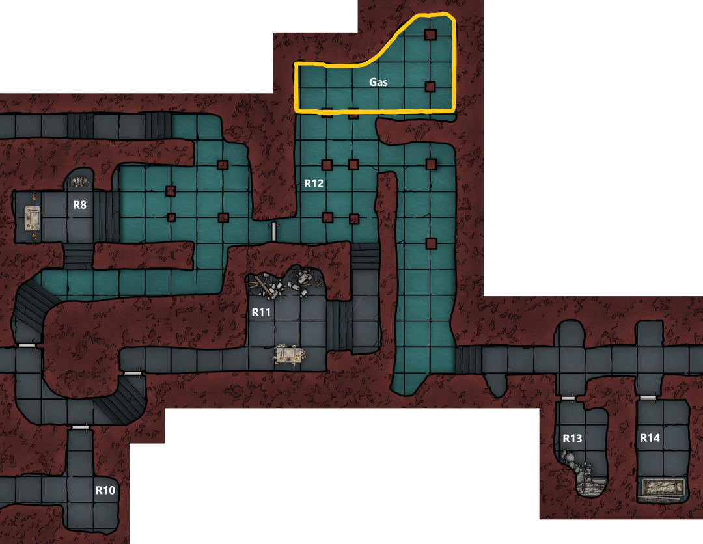
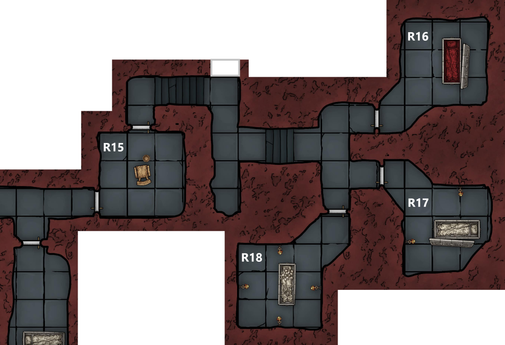

After taking a chance to catch their breath and patch up any wounds, the party continues on
- Eliseo leads the way heading out of R9 and south along the corridor
- Here there is a door in the right wall and steps up ahead leading to another door
- He cautiously opens the door to the right, beyond is a small, empty room (R10) leading to another corridor
	- The corridor looks unused and Eliseo doesn’t think its been walked for a long time
	- He indicates that the party should move past

Marco moves ahead and opens the far door

Beyond the door is a short corridor leading to another room (R11)
- Here the party finds a third altar
- Decorated with humanoid skulls and half melted, unlit candles
- Behind the altar there is another message:
	> Present to me bones of the long dead so we can build again an army, you will be rewarded

- Marco sketches the altar
	- Looking more closely at it he believes it to be less than a year old
- Vigil and Marco discuss the altars that they have seen
- Marco decides to destroy this one, pushing it over and scattering the skulls and candles on the floor

At the back of the room there is a collection of alchemical equipment and here Hayate finds 3 red potions which he believes to be Potions of Healing
- He distributes them to Marco, Vigil, and Strum

Eliseo scouts further ahead
- Finds a large, flooded room (R12)
- At the far end of which he can see some sort of a fog in the air
- He can smell gas, potentially flammable

The party confirms that they have no flames burning and wades into the water

At the far end they find a thick yellow haze in the air
- Within this Eliseo spots something glistening in the light of the spells
- Can vaguely make out a sunken humanoid figure
- Strum takes a rock and gets Marco to cast light on it before throwing it through the fog
- It illuminates a blackened corpse wearing a pristine silver band on its head
- Uses his Mage Hand to lift it off the corpse and retrieve it from a safe distance
- The band appears to be pure silver with a small triangular icon at the front
- Strum avoids touching it and maintains his Mage Hand to carry it, repeatedly muttering to cast the spell
	- Hayate and Marco say they will take a closer look at a better time

The party moves to quickly leave the flooded chamber and finds clearer air beyond
- There is a long corridor with several alcoves and doors along its length
- At the far end there is light coming from beyond a closed door

Eliseo advances along the corridor and listens at each door in turn
- Hearing nothing beyond the first and second doors
- Behind the third he can make out the heavy breathing of several creatures
- Beyond the end door he hears sobbing

The rest of the party moves up and checks the doors
- Behind the first is a small room (R13)
	- The ceiling in here has collapsed, the rock fall covering a sarcophagus
- Past the second there is another small room (R14)
	- Also contains a sarcophagus - has a mural carved on the side
	- Lid is off
	- Full of dust, with no body

Leaving the 3rd door closed Vigil opens the far door and moves inside (R15)
- The room beyond is lit by torches
- Blood covers the walls and floor
- In the centre there is a sturdy wooden chair with a whip draped over it
- A bucket on the floor is full of salt

Chained to the walls are 2 mostly naked bodies
- Middle aged human male
	- Covered in wounds
	- Athletic body
	- He is dead, probably for several hours
	- Vigil recognises him as Lorenzo Di Ricci
		- Captain in the Hellriders
- Halfling male
	- Source of the sobbing
	- Portly

Eliseo cracks the locks on the halfling and Vigil lowers him to the floor
- Vigil reassures the halfling that he is safe
- He introduces himself as Cicero Grubb
	- Marco and Eliseo recognise the name as belonging to a relatively wealthy halfling family that run several bakeries
- Cicero informs the party that there will be several cultists beyond the other door in this room
	- Believes this is where they sleep
	- He mentions hearing a sound like stone grinding on stone

Vigil asks him what they were interrogating him and Lorenzo about
- He says they were after information on the city, about his business and noble families
- They were interrogating Lorenzo about what happened to Elturel
	- Not sure if they knew what had happened
	- Looks like they caught Lorenzo investigating this place
- Vigil offers him a blanket and Strum heals him whilst Marco sketches Lorenzo’s body

Vigil informs Cicero that they need to continue on to stop the rest of the cultists and offers to hide him till they return
- Carries him to R14 with a torch and tinderbox
- He hides beside the sarcophagus
- Coming back Vigil takes the silver band off Strum’s mage hand in exasperation and puts it in Marco’s bag

Eliseo leads the way through the door to the north into a corridor that bends to the right
- Following it along with a light he hears a sudden exclamation followed by the sound of someone running away
- The party gives chase through a winding corridor, spotting a heavily armoured, fleeing cultist who yells, ‘Intruders!’, as Eliseo catches up to him

The cultist flees into R18 and the party can hear several footsteps from behind the door to R17
- The party bundles into the corridor and is engaged in a close quarters melee in the tight confines of the corridor with 5 armoured cultists

Looking through the door to the north, Eliseo can see an open sarcophagus filled with blood (R16)

The narrow corridor greatly restricts the parties movement and the heavy armour and shields of the cultists proves difficult to overcome
- Vigil takes a couple of heavy hits and is forced to retreat, using up both his own Potion of Healing and Marco’s in the early stages of the fight
- Marco manages to finish off the initial guard and the party turns to focus on the four cultists in R17

During the combat, Marco and Strum hear a bubbling noise from the blood sarcophagus followed by a wet slapping sound
- Looking around Marco can see the blood in the sarcophagus is moving and there is a bloody mass behind the edge of the sarcophagus

Frustrated by the cultist’s armour, Eliseo goes into a rage, blocking the corridor and hacking at the man in front him before taking several hits in return

Strum spots a form rising up from behind the sarcophagus
- Covered in blood, with long hair
- Naked
- Appears to be an old lady

In panic he tries to fire a shot at her, fumbles and hits himself in the head
- The old lady cowers behind the sarcophagus

Marco attempts to persuade the remaining two cultists to surrender but Eliseo’s bloodlust dissuade them from taking the offer

After a few more exchanges of blows the final cultist is finished off

The old lady advances slowly and cautiously
- She asks if they are ‘one of them’
- Claims that she works up in the bathhouse and was kidnapped

Marco goes to use prestidigitation to clean the blood off her
- He can see blood fly off her on to the floor but there is a delay before it disappears from her body
- He draws his rapier again and points it at her, declaring that she is under some sort of illusion

The old woman tries to explain that she was hiding in the blood and attempts to persuade Eliseo to help her as an Almogavar but she is met with hostility from Marco and retreats into R16
- The party follows, Hayate grabbing a tabard from a dead cultist and tossing it to her to wear

As Marco sketches the sarcophagus, Vigil attempts to talk to the old lady, approaching her and patting her on the shoulder
- He notices that there is a slight disconnect between what he feels and what he sees
- He is conflicted about what to do about this

Marco decides to destroy the sarcophagus and gets Hayate to smash a corner, releasing a torrent of blood onto the floor

The old woman tries to slip around Vigil towards the door, as she turns her back to him, he makes up his mind and draws his flail, hitting her from behind
- The illusion drops and the old lady is replaced by a naked, blood covered young woman
- She turns to face Vigil, says ‘see you soon’ and vanishes

She rushes out of the room, slipping past everyone towards R15 and the party charges after her
- Marco bumps into her invisible form
- She reappears snarling at him and slashes at her own neck with a long nail
- A red glow forms over her before she vanishes again

Whatever magic she has cast seems to be unnerving the group, Eliseo hesitates when trying to shoot at where she was

Vigil takes his cloak and tosses it over her to reveal where she is hiding
- Reveals white and red tabard with a horse wreathed in flame and a sun
- Eliseo and Strum recognise is as the symbol of the Hellriders of Elturel
	- Eliseo knows their presence in the city is banned by the Almogavars

Marco is unable to overcome the effects of her magic, but Hayate is able to rush her and knock her prone into a cul-de-sac
- She reappears still covered in the red glow

Now trapped she offers information for her freedom but does not appear scared

Vigil offers her an ultimatum, surrender or die
- Whatever he does it seems to work, she is cowed and the magic drops
- She surrenders
- Vigil lets her use his cloak to cover herself as Marco manacles her, binds her hands and gags her to prevent spellcasting
- Marco cleans the blood off her

Interrogating her she reveals the location of a secret door in this corridor

Party is clearly battered and decides that they need to rest
- Eliseo is not happy about resting with the prisoner around
- Marco has some contacts that he could have take her off their hands
- He pulls out a notepad and writes a message before putting it into a pouch
- A few minutes later papers appear in the pouch with a response

Marco and Strum take the prisoner and head back to collect the halfling
- He was hiding in the sarcophagus and whilst in there found a false floor
	- Under this was a skeleton with 2 moonstones (50gp each) and a bag of beans inside its chest
	- He offers these to Strum as thanks
- They head back to the bathhouse
	- Here they encounter an irate customer
	- Strum pretends that they are cleaning staff
- Outside they wait for Marco’s contact
	- Shortly after the customer storms out, tired of waiting for service
	- Hearing an owl hooting, Marco looks up to see an elf on the rooftops
		- Hands over the captive, the elf drugs her to keep her placid and takes her away
		- Grubb offers a free loaf of bread at his bakery

The rest of the party stakes out in front of the secret door
