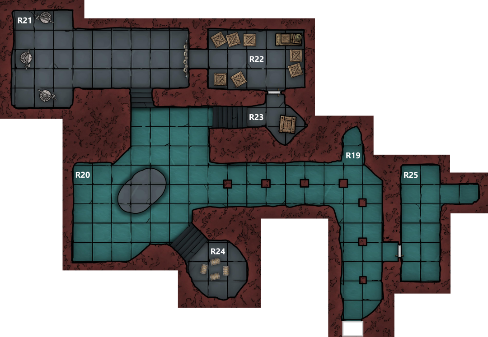

The wait is uneventful but listening at the door Eliseo hears some muted sounds over the last 5-10 minutes as the party waits for Marco and Strum to return

The secret door pushes open to reveal another flooded room (R19) which bends around to the left
- There is a door in the right wall
- Eliseo scouts ahead and peers around the bend to the left

There is a light here, resting on a rock that rises out of the water (R20)
- Floating in the water around the rock are several black clad corpses and standing upon it are two figures engaged in combat
- One has a head that appears to be a skull covered in blood, although the rest of him appears human
	- He is clearly injured, one arm hangs loosely at his side
	- Wielding a dagger in his other hand
- The other man is huge, 7ft tall and very bulky, he has no armour and is carrying a wooden club
	- Also very badly injured

The combat pauses, it is clear they are both exhausted
- Eliseo reckons that the big guy will lose based on his injuries

Noting that the larger man is not wearing any cultist paraphernalia the party decides to help him out and Eliseo takes a shot at the skull headed man
- The shot misses, clinking off a wall and distracting him long enough for his opponent to get a glancing blow in
- As Eliseo moves up to take a second shot he is noticed by the skull head who snarls at his enemy “Your friends can’t help you” before fleeing out of sight to the north

Strum listens at the door to R25, hearing the sound of running water

Party moves up to the rock as the large man slump to one knee, supporting himself with his club
- Introduces himself as Victor Bandiera
- Admits that he runs the cults on behalf of his mother but claims not to be a believer
- Claims that his brothers have backstabbed him and turned the cult against him
- Vigil heals the worst of his injuries
- He is not willing to talk until the final assassin is dead, informs us that there is no other way out

Moving up the stairs to the north the party enters a room that Victor says is a meeting space for the cult (R21)
- There is a large map of the city on the wall
- To the right there is a curtain
- To the left they can see wooden statues representing the three demigods worshipped by the cult

As they approach the statues the light from Hayate’s shield reveals a shimmering distortion to the north, which fades to reveal the skull headed man who shouts “For Bhaal” and charges
- Rushing to face him Marco passes close to the statue of Bane and is overcome by a feeling of oppression, he is forced to drop to one knee before it
- The others rush the cultist who moves with a serpentine grace and after stunning Vigil with a gaze from his skull face is able to slip around and avoid being pinned in

Realising what’s happening, Strum casts Friends on Marco in an attempt to snap him out of it
- The party manages to trap the cultist in the corner and Hayate and Vigil manage to push over the large statue of Bhaal, pinning him under it before Victor crushes his skull with his club
- As he dies the skull effect fades

Marco rushes over to Strum and hugs him
- Then a few seconds later looks back at the statue and then again at Strum in anger and accuses him of ‘poisoning his mind’
- Strum tries to persuade him that he was only trying to save him from the statue

Vigil starts to question Victor, starts off asking about Elturel
- Victor says that his mother (Duke Adelina Bandiera) was involved somehow and that she is trying to make the same thing happen here
	- She can be found at her villa in the noble district
	- She was the financier for this cult
	- He informs them that she has ambitions
		- Came from the merchant class originally
		- 3 dead husbands
		- Known to be ruthless
	- Victor is terrified of his mother and plans to leave the city
- He thinks his brothers tried to have him killed
	- Gaetano and Agostine
	- Agostine can be found at the Low Lantern tavern where he lends money
		- Marco and Eliseo know this is a boat that has been converted into a tavern

Hayate inspects the statues
- Bane
	- Carrying a real red spear
- Myrkul
	- Hooded, skeletal hands holding a skull lantern
	- Leather bag of bones around its neck
- Bhaal
	- Noble’s outfit
	- Leather mask in harlequin colours over a skull visage

He takes the spear, bag and mask, assessing them to be magical
- Then topples the remaining statues

Eliseo, Marco and Strum investigate behind the curtain, finding a storeroom filled with crates (R22)
- Here they find a desk with maps and papers
- The maps are marked with the locations of cult attacks, including the one on Eliseo and Isabella
- Marco transcribes a note:

>“Your dullard of a brother has been dealt with as requested, we will be able to operate much better without his input. The funds are low, we need more if we are to continue to expand and enact the Duke's plan.  Attacks will be ramped up once we receive those funds. Coin is coin, but some of the members have reservations about its origin, will it continue to be stolen from…”

- Eliseo collects everything to report for Deslaur.

In the crates Eliseo discovers:
- 10 days’ rations
- Caltrops
- 3 flasks of alchemist’s fire
- 6 sets of manacles
- 4 tinder boxes
- 4 Healing potions
	- Strum gives one to Victor

In R24 Eliseo finds 4 chests, mostly empty but containing 54g 78s, 40cp
- This is divided up including a share to Victor
- Hayate feels 5 marks on the coin and identifies them has having belonged to the cult of Tiamat at some point
	- She is the first evil spawn of Tente
	- Obsessed with wealth and gold

Heading back alone, Eliseo opens the door to R25, opening the door and peering in
- Sees that the far end of the room seems to be the collapsed parts of a cellar
- He spots a sword shining in the corner and enters the room to get it
- As he walks through the water 4 skeletons rise from below and attack
- He is able to flee the room and call for help
- The rest of the party rushes over and, with the help of Hayate’s Turn undead, defeat the skeletons
- Eliseo collects the sword, an elaborately decorated scimitar

The party heads out of the sewer, collecting the body of Lorenzo and the plate armour on the way

They part ways at the bathhouse:

Eliseo
- Goes to report to Deslaur
- Congratulated
- Tells him about Duke Bandiera’s role
	- Taken aside and told to keep quiet about it but to investigate further
	- If Duke Alfieri returns then they’ll report to him, if not then the Bandieras might be their new employer
- Reports Hellrider presence and is told to keep an eye on him.
- Shows him the sword
	- Deslaur gets a mage called Benicio to identify it

Hayate
- Returns to the tavern to meditate
- Casts detect magic on the items:
	- Mask - illusion
	- Bag of Bones - Necromancy
	- Spear - enchantment/evocation
- Attunes to the spear - Spear of Tyranny +1

Marco
- Writes a note about Victor’s misdeeds, and sends it to his organisation so they can pick him up before he escapes the city
- Heads to a magic shop, full of unseen servants
	- Sells the spellbooks for 250gp
	- Learns Burning Hands
	- Gets the headband identified for 5gp as a Circlet of Blasting
	- Sells two Alchemist’s Fire for 100gp

Strum
- Gets the moonstones appraised and sells them for 100gp
- Goes to the same magic shop and gets the Bag of beans identified
- Visits Hetty and trades in his leather armour to buy some studded leather

Vigil
- Takes Lorenzo’s body to a temple for cremation
- Takes the armour to the Tong Tied smithy
	- Run by a female dwarf and a male elf
	- 200gp to resize the armour
	- 20g to remove the engraving and 10gp to put on a new design
	- Will take 3 days
	- Pays them 20gp now with the rest on delivery with the armour as collateral
- Returns to the temple that evening for the funeral
- Stays up all night in Vigil at the altar to Heol
	- Takes the oaths of his order, alone
