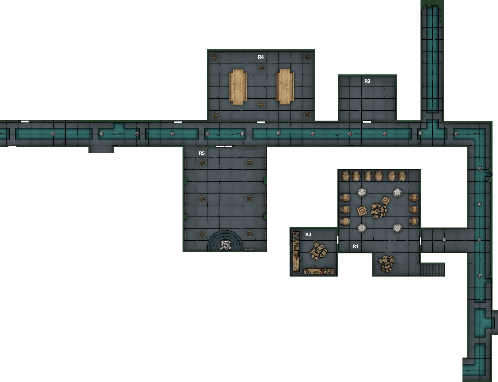

Party continues its way to the Bandiera mansion
- On the way Strum makes use the charm person to talk with Agostino
- Pretending to be coerced by the rest of the party and suggests that they could escape together
- Gets some information about what they’re walking into
	- Gaetano sent the devils earlier so he must know they are coming
		- The party is probably being watched by imps
		- Guards probably know they’re coming
	- There are 9 guards on the perimeter with more inside
	- His mother has forces in the basement including fiends
- He persuades Agostino to play it cool till the party is in the basement
- Uses message to let Vigil know what he has learnt

Eliseo gets the group past the guards at the gate to the upper city, telling them they are under orders from Deslaur

Reaching the mansion, the party approaches a small side door
- Vigil bangs on the door, which is opened slightly a few moments later by a guard
- Vigil tells him to open the gate for Lord Agostino
- Guard welcomes the noble, manacles hidden under the cloak
- Agostino, shares a glance with Strum and grants admission for the rest of the group

Entering the mansion grounds the party is lead by Agostino around the house to the front door
- Here he asks to be unshackled and Marco obliges
- He asks again what we want and Vigil reiterates that we want to talk to his mother

Walking into the mansion
- Greeted by a butler
- Agostino orders refreshments, wine and cheese and the group is directed towards the dining room
- Strum attempts to distract the Butler by asking him to acquire a lyre

There is a voice from up the staircase and, looking up the party sees a thin, pale, middle aged man standing at the top
- He directs the butler to get food
- Says he wants to talk with Agostino and the party
- Introduces himself as Gaetano as we enter the dining room

Inside the dining room
- Here Vigil senses four fiends in the chandelier above
- Food and wine are delivered
- Agostino takes a seat and puts his feet up, taking a drink of wine
- Gaetano informs us that he wants to make a deal
- At the same time Agostino starts to froth at the mouth and choke before collapsing, poisoned by his brother
- Strum spits out the cheese he had been cramming into his mouth

Gaetano wants the party to kill his mother but let him live
- He will resign the dukedom and make a large donation to charitable causes in the city
- But he will remain head of the family
- He claims that the devil summoning was done by his mother and so will stop once she is dead
- In return he will tell us what he knows and will call off a number of the imps and spined devils that he has control over in the mansion

Upon questioning, Gaetano reveals that he doesn’t know exactly what has happened to Elturel but he does know that his mother was involved alongside her fiendish patron
- He also informs the party that the High Overseer of Elturel is in the basement with his mother
- He claims that he his here willingly and that he is investigating an artefact, a shield stolen from the Menoti family crypt which he plans to use to bring down Rossano Calabro
	- Reya does not believe that the Overseer is here willingly and says that the party must go rescue him
- He says that the Overseer brought a small puzzle box with him when he arrived
- Gaetano has managed to acquire this but has been unable to open it
- He offers it as part of the deal
- His mother’s fiendish patron is ‘Zariel’

Vigil reluctantly accepts the deal
- Gaetano assures them that his mother does not know they are coming
- Tells them that there are 4 guards upstairs and at least a dozen cultists downstairs alongside two devils
	- Odious - in the temple
	- Another in the cells

Gaetano positions the body of Agostino in the chair to make it look like he is sleeping and wipes off the froth around his mouth before leaving, taking the invisible imps with him
- He asks the party to give him five minutes to get out of the mansion

The party discuss their plans as they wait

Curious, Vigil opens the door to the south to find a maid listening at the door
- He confronts her and she admits she heard something about a deal but claims she was only listening after Gaetano left
- Upon further questioning from Marco she informs them that she sometimes hears screaming from downstairs and that she can often hear the voices of invisible things around the house
- She tells them that Gaetano is the eldest brother but Agostino was always the favourite
- Apparently there is a scary suit of armour in the Duke’s study which stands up on its own
	- She is allowed in to clean though
- The maid recognises Marco’s badge and seems to be a believer in the cause

As they talk with her an invisible imp lands on Eliseo’s shoulder and hands him the Puzzle box before informing him that Gaetano has left the premises
- Box is wooden with gold inlay
- Has intricate carvings and sliding segments

Marco gets the maid to take him upstairs to the Duke’s study
- He waits in the powder room and gets her to go inside and bring any books or papers she can find
- She returns with several books
	- Mostly unopened first editions for appearances
	- One other book which has been hollowed out and contains a key

Marco decides to check out the Duchess’ bedroom
- Large room with a bed, fireplace, iron bathtub and a bound chest with a padlock in the shape of a devil’s face
- Investigating the chest he determines that it is trapped, but not the lock
	- There is a springloaded mechanism in the base, held in place by the contents of the chest
- He opens the chest to find several ledgers, a poisoner’s kit and cartographers tools, a large money pouch and a set of musical pipes
- Vigil comes upstairs to look for him and they other objects in the room to weigh down the trap
	- Marco takes the ledgers but cannot read them
		- Vigil informs him that they are written in infernal and contain business accounts
	- Vigil inspects the coin purse (22pp, 85gp, 113sp) and the pipes
		- Pipes are wooden and carved with images of mice and rats
	- After Marco leaves the room he pockets the money and follows, handing the pipes to Strum

Vigil asks the maid to lead us to the basement door and suggests she finds somewhere safe
- Need to go through the kitchen - past the butler and chef
- Vigil asks the maid to try and get them out of the room, she seems quite excited by this and agrees
- He hands her 5pp, her jaw drops
	- Eliseo notices this with wide eyes
- The maid heads in and clears the room

The party heads in after, sprawled on a table is a large fluffy cat with wings
- Vigil determines that it is not a devil
- Strum recognises it as a Tressym
	- Apparently they were created by a wizard and are rather smart and loyal creatures
	- He pets it and offers it cheese
	- He is about to tell the party about the origins of Tressym but is interrupted by the returning voices of the chef and butler
- The party quickly moves into the room with the stairs down, followed by the tressym
- In the room beyond the tressym starts hissing at something near the ceiling
	- An imp reveals itself, telling them to keep the cat away from him
	- Vigil picks up the cat, holding it high and approaches the imp who flaps out of the room

The Chef returns to the kitchen and the party hear the Maid excuse herself from the mansion  
- Strum asks the plan
- It is agreed that they will try and bring the Duke in alive

Reya takes Vigil aside and asks if he believes that Overseer really is crooked
- Heading down the stairs they find themselves in a storeroom (R1)
- Supported by 4 stone pillars and filled with racks of barrels and a few piles of boxes
- Hayate approaches the door to the right and his feet crunch on spines littering the floor
- Kicking the door open he can see a tunnel beyond
	- Lit by green glass lanterns in the ceiling
- Checking the door to the left he finds a storeroom filled with bottles of wine (R2)

The party moves out into the tunnel, with Eliseo scouting ahead
- Clear that this is a sewer
- The air is filled with the heavy scent of incense
- Moving north and around the bend Eliseo can hear nothing at the first two doors to the north which are revealed to be a cold room (R3) and a dining room (R4)
- He can hear chanting from a pair of double doors to the south

The party stacks up next to the double doors, Marco casting Blur before entering
- Can hear a hymn being chanted in infernal
- The name Zariel is heard along with mentions of the Blood war
- Above the door written in infernal is “That which falls can rise again”

Charging into the room (R5) they can see a 7ft statue of an angel with glowing eyes opposite the door
- In front of the angel is a human sized devil covered in sharp barbs, with 4 robed cultists chanting on their knees, backs towards the door
- Eliseo shoots the devil in the face as the doors slam open and Hayate and Marco charge the cultists
- The cultists are quickly overwhelmed in melee and blasted by a thunderwave from Strum as the devil charges into combat, lashing out with its claws and barbed tail
- A panel at the back of the room swings open and a large woman strides into the room flinging blasts of force at the party - It’s the Duchess
- Finishing off the last cultist, Marco rushes her
- From back in the tunnels Strum hears the Tressym hissing and goes out to investigate, finding two more cultists approaching down the sewer
- Strum and Eliseo move to meet the new cultists as Hayate, Vigil and Reya surround the devil
- The Duchess rolls up her sleeves and starts throwing punches at Marco forcing him to put up a Shield to block the blow
- Hayate stabs the devil with his spear and channels necrotic energy into the wound, causing it to rot
- With some distraction from the Tressym, Strum and Eliseo finish off one of the cultists, the other turns to flee but is electrocuted by Strum
- After failing to hit Marco the duchess starts to mutter in Infernal and glowing script appears on her forehead and knuckles
- Marco lashes out at her and hits but is blasted in return by a gout of flame which knocks him unconscious
- Returning to the room Eliseo and Strum focus fire on the Duchess to keep her from beating Marco to death
	- In return she flings blasts of force at Eliseo
- Hayate, Reya and Vigil hem the devil in and steadily chop it to pieces
	- Finally, impaled on Hayate’s spear and having lost an arm to Reya, the devil is finished off as Vigil shield-punches it in the face and runs it through with his longsword
- The group rushes over to surround the duchess and starts beating up on her
- Hayate hopes to use the power of his spear to make her kneel, perhaps to get her to surrender, but she resists
- Getting angry, Vigil’s sword ignites and as he hits the Duchess she goes up in flames
	- She shouts out “Zariel, I join you in the Blood War” as she burns to death

With the combat over Strum slumps to the floor exhausted, most of the party looks pretty beat up
- Eliseo grabs Marco’s notebook and starts sketching his unconscious form as Vigil leans down to wake him up

Vigil is seething, he wanted the Duchess alive for questioning
- Storms away from the body and inspects the statue
- The head appears to be hollow and something inside is emitting the light
- He recognises the subject of the statue, although she is not how she appears now

Hayate checks that Strum is doing ok and gives the cat an ear scratch
- Eliseo asks Reya if any of the dead were her overseer, to which she doesn’t take kindly

Finally Vigil grabs his flail, looks up at the face, says, “You don’t deserve to look like that anymore” and slashes the face, which shatters like a porcelain egg
	- Flying out of it is a mace made of stone
	- Carved to look like a pair of angelic wings wrapped around the mace head
		- It is well balanced
		- Writing in celestial provides a command word to turn the light on and off
- He picks it up and sits down on the dias looking troubled

The party decide that they desperately need to rest and moves to the dining room they saw earlier to hole up in.
