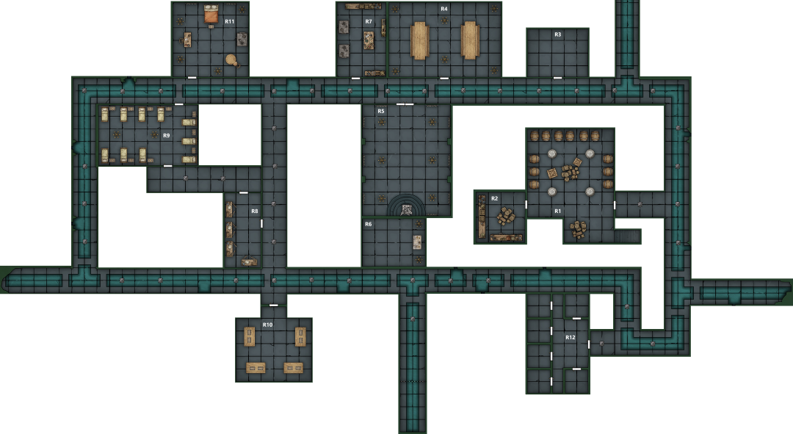

In the dining room Marco drops down into a corner in exhaustion as the party attempts to catch their breath
- Hayate casts a healing ritual to provide some relief
- 20 min after entering the room Strum hears footsteps approaching from the west
- Followed by shocked voices outside as they find the bodies
- Can hear them open the doors to the shrine and a loud conversation between 3-4 people, possibly wearing masks
- They seem distressed and are debating whether to escape or search for the culprits

Party decides to rush them and try to take a prisoner
- Vigil kicks the door open and Hayate and Eliseo charge out to engage the cultists in the shrine room
- Cultists are wearing robes and angelic masks that appear to be made of stone
- There is a scrappy fight in the corridor against the 3 unskilled cultists
- Emerging from the shrine room, a cultist in a more elaborate robe casts a spell, summoning a floating, spectral sword to attack and creating a blast of ethereal flame under Hayate
- The spellcaster’s eyes are wild and as the party cuts down the rest of his group he goes mad, throwing himself barehanded at Vigil before attempting to flee past the group
- He is cut down as he runs

<!-- -->

- Marco removes his mask to find an elvish male with a manic expression, he sketches his face
- Strum finds that the mask is made of plaster and would likely be hard to breathe in
	- He notes that it doesn’t match the cultists that were making attacks in the city
- Vigil starts dragging bodies to the cold room (R3)
- Marco goes to draw the Duchess’ burnt corpse and checks her pockets, finding two keys
	- One is large and very ornate
- Eliseo rifles through the bodies and acquires 12gp

The party returns to the dining room
- The Tressym is missing, following its yowls Strum is able to track it to the cold room where it has been feeding on the dead
- The party is able to patch themselves up

Returning to the shrine they investigate the secret door that the duchess emerged from
- Behind it there is a small room containing 2 candlesticks each with 9 candles flanking an altar made of obsidian
- Arising from the top of the altar is a flame formed in the rough shape of an angel

Looking around the shrine the party realise that the 9 tapestries each represent one of the 9 levels of hell
- The 1st has a one handed angel wreathed in flame flying over a battle between two armies fighting next to a river running through a barren wasteland

Outside the shrine Strum casts comprehend languages
- He is able to get impressions from the Tressym
- It wants food

Eliseo opens the door next to the dining room to find a kitchen (R7) and offers the cat some cheese

Continuing on to the west the tunnel branches to the south, Eliseo can hear a voice calling out in that direction and leads the party that way
- Checking a door on the right he finds a cloakroom containing 4 wardrobes full of cloaks and masks
- Eliseo and strum but on some cloaks and Strum takes a mask

Heading through the door to the north Strum finds a short corridor leading to a dormitory
- He and Hayate slip inside and spot that one of the beds contains a sleeping cultist
- The Tressym follows them into the room and rushes over to a footlocker declaring that it smells funny
	- Strum opens it and the cat jumps in and starts messing with a boot
	- Picking it up Strum finds a glass ball containing a crystal

Strum sits on the bed next to the sleeping cultist and starts to play, casting friends as he attempts to bring him into a barely awake state
- His creepy hypnosis is successful and Strum is able to persuade him that he is a fellow cultist
- He confirms that the overseer is here and that the Duchess had the key to get him
- Jailer has the key to the jail

Eliseo heads down to the door at the end of the corridor, he can hear a muffled voice beyond asking for help
- Getting the key off Marco he opens the door
- Beyond there is a man in his 60’s
	- Wearing plain clothes and carrying a candlestick
	- The light from the candle casts a the man’s shadow, instead of his form there is a short, pudgy horned creature with wings
	- He looks at them in confusion and asks if they are here to rescue him
- In the room there are several wooden strongboxes and a golden shield mounted on the wall

Seeing the devilish shadow Marco yells “devil!” and he and Eliseo draw their swords
- The old man recoils back in fear, begging that they don’t hurt him

Reya recognises him as Overseer Dante Vespucci of Elturel and rushes in kneeling before him
- Vigil also recognises him and snaps off a salute before asking how he got here

The Overseer informs them that he was outside the city visiting a local village on the day Elturel vanished
- He saw the storm and the city disappear
- He travelled here with refugees seeking help and was kidnapped by the Duchess
- The Duchess wanted him to investigate a shield - but he’s not an academic and doesn’t know anything about it
- Claims he’s been locked in this room since he was kidnapped and has not left
- Claims that the devilish shadow is a curse the Duchess has put upon him

The Overseer seems nervous
- Marco decides to prove he’s not a devil by soiling him via prestidigitation
- He splatters him with mud, confirming that he’s not an illusion

Vigil asks why the Overseer was told to look at a shield when he’s not academically minded
- Overseer says he’s not sure, maybe because he’s divinely empowered
- Claims the shield is holy

Continuing the questioning Vigil mentions that Gaetano claimed that he was here willingly
- The Overseer claims this is preposterous

Searching the room Strum finds an ivory bladed dagger with runes in Draconic
- It says ‘fang’ and it may have been used as an item of ritual importance

The strongboxes in the room contain valuables
- There is no sign of a bed or anything
- Strum is suspicious of the Overseer’s story

Vigil gets the puzzle box off Eliseo and offers it to the Overseer saying that he knows it belongs to him
- He denies ever seeing it before
- Vigil says Gaetano had got it from him and he was only returning it
- Dante refutes this and says nothing the Bandieras say is worth trusting

The party has mixed feelings about the truthfulness of Dante’s words but nothing he has said seems to be a lie so they decide to escort him out after checking the rest of the dungeon for clues to where Elturel has gone
- Reya is assigned to protect the Overseer

Vigil goes to inspect the golden shield
- Mounted on the wall
- Ornate, snarling face
- It seems usable
- He slings it over his back for inspection later

The party heads back north and opens the door to R11
- Fancy bedroom with a large bed, a chest and desk
- Tapestries showing spirits rising from a river and a man dangling from a hooked chain
- Inspecting the desk Eliseo finds research papers referring to the “Shield of the Hidden Lord”
- In the chest is some fancy male clothing and a medallion
	- Sunburst with an eagle flying in front of it
	- Marco recognises this as a symbol of Heol
	- Spotting it Vigil is suspicious that it belongs to the Overseer and that he has been lying

Vigil starts to interrogate the Overseer, trying to find holes in his story
- Offers him the medallion back
- Notices that he hesitates before taking it, as if afraid it might hurt him
- Asks him about the clothing and the room

Marco draws his sword, convinced that the overseer is a devil

Frustrated by the Overseer’s evasive answers Vigil storms into the dormitory, grabs the sleeping guy and clocks him in the face, dragging him confused and half awake to the door and demanding to know who’s room this is
- The cultist says it’s Vespucci’s room and screams for help
- Vigil punches him again
- The cultist says that Dante has been working with the Duchess
- Vigil drops him and turns back to the overseer accusing him of lying

Reya tries to interject but Vigil declares that ‘he’s either possessed and lying or a traitor’

Strum and Hayate discuss trying to exorcise anything that might be possessing the Overseer
- Hayate puts his amulet in the palm of his hand and wraps the chain up his arm
- Strum uses message to tell Vigil to say if he wants Hayate to try
- Vigil tells him to ‘do it’

Hayate pushes him down into the chair and tells Vigil and Reya that this shouldn’t hurt before pressing his amulet to the Overseer’s forehead and attempts to exorcise any devil
- The Overseer is terrified
- He senses the spell register something in the Overseer but it doesn’t interact with it
- He confirms that the Overseer is not possessed

Vigil returns to interrogating
- Demands to know why the Overseer wasn’t in the city on the day of its disappearance
- Especially as Duke Alfieri was to arrive in Elturel on that day
- Overseer tries to pass it off based on the time of day

Vigil has had enough
- Looms over the Overseer and attempts to scare the truth out of him
- Hayate, standing behind the Overseer with a grip on his shoulders, assists

The Overseer flinches away from Vigil and bursts into tears
- He admits that he was working with the Duchess
- Claims that he was forced to by his Patron
- He made a deal a long time ago with Zariel
	- In return for providing the companion to defeat the vampire lord he twisted he oath that all Elturellians make
	- Instead it is a pledge of allegiance to Zariel
		- Apparently Vigil did not make the pledge due to his heritage
	- Elturel has been dragged to Avernus, it’s surviving people are to be forced to fight in the Blood war
- The shield contains a being, that he intended to unleash upon the city
- When he sees the puzzle box again he grabs for it manically
- Won’t tell them what’s in it

<!-- -->

- Vigil is outraged that he made a deal with an archdevil and strikes him
- Reya is stunned

Marco offers Vigil his manacles but Vigil turns him down
- Charges him with murder, consorting with devils and treason before beheading him
- The overseer’s shadow detaches and crawls away into a corner before disappearing
- Reya looks at Vigil and says “I can’t believe you just did that;  I also can’t believe I think you did the right thing.  We have to save our city - the people, they can’t be left to die in that place.”

Returning to R10 Marco and Eliseo look to loot the hoard
- Hayate informs them that it is Tiamat’s wealth and that he considers it cursed
- This doesn’t stop them grabbing the loot, either for themselves or their organisations
- 30 electrum ingots (10gp ea, 300gp total), 100 gp, 100pp, 20 gemstones (10gp ea)
	- Marco takes the ingots, Eliseo the platinum pieces, Hayate the gold pieces and gemstones

Completing the tunnel loop on the way back to the exit the party finds another door
- Opening the door they find a broad-shouldered, 8ft tall devil with a beard of tentacles
	- It is wielding a large glaive

After defeating the devil Marco discovers that one of the cells contains someone he knows
- Francesca Flack, a halfling
- He frees her from the cell and she grabs her stuff including a spellbook and dagger
- She seems rather competitive with Marco
- Members of the same organisation
- She mentions that there is another prisoner

Find another woman in another cell
- Ariane Menotti
- Entitled noble woman
- Let her free, she promises a reward
- Spots that Vigil is carrying the shield from her family crypt and demands its return

The party leaves the sewers and leaves the mansion
- Hayate arranges to meet back at the inn, studies the dagger etc., tries to mend it etc. and throws everything on his loot pile
- Marco and Francesa go to report
- Eliseo escorts Ariane back, getting a 5gp tip, and leaves the details of their inn before returning to bed
	- Plans to report to Deslaur
