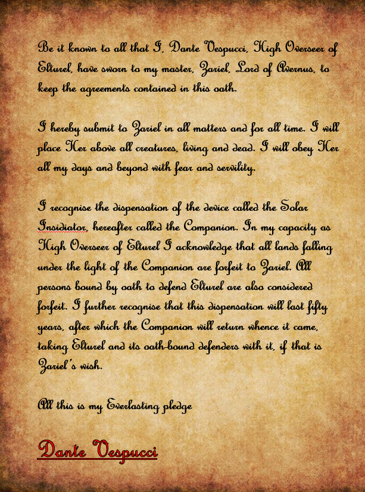

Marco and Francesca head to Casimo manor
- Marco wants to report to his master Ilaria
- Use a secret sewer entrance to get into the manor
- Is met by the manservant Flavio
	- Informs Marco that Ilaria is on the front lines and currently only sending stone communication is available
- He heads to his room to wait
- Is woken up upon her return and taken up to the tower where she has her workroom
- Magical laboratory
	- Alchemy tables, teleportation circles, etc.

Ilaria, a Tiefling is sat behind a desk, writing notes
- She looks tired and unkempt and is clearly distracted by her work
- Marco reports that Duke Bandiera is dead and gives her his notebook to detail the entire story
	- She seems used to this and quickly reads through it
- She confirms that Victor Bandiera was captured
- They discuss the Overseer’s role in the disappearance of High Duke Alfieri and that the Bandieras were behind the Cult of the Dead Three
- Marco hands over the electrum ingots and platinum pieces he took from the mansion
	- Ilaria confirms that some of the money has the markings of Tiamat
- They discuss the power vacuum in the city
- Ilaria wishes to see the puzzle box

Back at the tavern Hayate mends the dagger
- Ornate, and valuable as a novelty but also as a cultural artifact from Tiamat
- Not magical (lost with breaking if it ever was)
- He carefully wraps the blade, then looks over the other items he acquired:
	- One crystal ball, at least it looks like that
		- But it is magical and will need taking to a shop for investigation
		- It’s also packed away

Strum heads to magic shop to look at books, and information on using Bardic magic ‘differently’

The next morning at breakfast the party discuss their next moves
- Vigil wants to go to hell to find out what has happened to the city
- He asks Hayate and Marco about their thoughts on the shield
	- Marco suggests that his master might be able to tell them more
- Eliseo arrives on his way to see Deslaur and turns over the puzzle box to Marco and the research notes on the shield to Vigil
- Marco looks over the puzzle box but finds it too complex to open
- Marco agrees to take everyone but Eliseo to see Ilaria
	- After making them promise to keep it secret

The research notes on the shield mostly discuss the history of the Menotti’s
- Old family with hints of infernal connections, mostly to do with procuring special items
- The shield is very dangerous and of immense power
- Notes don’t say how the Bandiera’s hoped to use the shield

Eliseo meets Deslaur for a debrief
- Reports the death of the duke and the actions of Gaetano
- Makes a proposal that the Almogovars could track down Victor and install him as puppet Duke over Gaetano
- Deslaur sees some problems with the scheme but does consider it
- His troops are investigating Eliseo’s reports

Deslaur pours Eliseo a drink
- Wants to talk politics
- He is concerned about the situation and worried that the Almogovars will soon be out of a job
- Thinks he might have to make a deal with the Casimo’s who he believes are running the Sconosciuta
- Eliseo tells Deslaur that Vigil intends to go to hell to find Elturel
	- Deslaur asks if he will go with them
- He pays up 225gp for each party member
- Brings out a small badge
	- Gets Eliseo to come to attention
	- Promotes him to Lieutenant

Meanwhile Marco takes Vigil, Reya, Strum and Hayate to the Casimo mansion
- They are brought up to Ilaria’s workshop
- Duke Alessandro Casimo is there, the head of the Sconosciuta
- They congratulate Marco on his successes
- Alessandro informs them that Victor and the smuggler from the bar have been sent to serve time in his mine but that the female cultist they brought in has been executed

Ilaria takes the puzzle box off Marco and spends several minutes studying it
- Eventually she declares that it is storing something and that it is trapped
- She starts casting a spell to open it
	- Air fills with glowing runes and waves of light
- The box opens and releases 9 linked plates of dark iron covered in infernal script
	- She is disappointed that Marco can’t read them
	- Gets Strum to read them out but tells him not to touch them
	- The plates contain the contract between Dante Vespucci and the Archdevil Zariel
	- It references the ‘Creed Resolute’, the oath made by Elturelians in service to their city

Vigil shows her the Shield of the Hidden Lord
- She recognises it
- Casts identify but is rebuffed by the being within
	- She can detect something sentient inside
- She tells the party some of the rumours she’s heard about the shield
	- Hidden lord could be anything, God, Dragon, Demon or Devil
	- Shield could grant great power but it might come at a cost
	- Undoubtedly an evil item
- They discuss whether to take it with them or return it to the Menottis
	- Decide not to leave it in the city
	- Hayate suggests his cohort might be able to do something with it
		- Ilaria is doubtful, possibly offended by Hayate’s dismissiveness of non-dragonborn magic

Party discusses their next steps and confirms their decision to go to hell
- Hayates companions were on route to Elturel by teleport when the city was taken and were seemingly taken with it
- Strum has some personal reason for wanting to go, not connected to the city

Ilaria believes she can get them to hell by linking to a teleportation circle she knows was in Elturel
- It will take two days to prepare
- Ilaria cautions them all that they must be sure about this

After the party leaves, Marco stays behind
- Ilaria tells him that there is much to learn in hell but warns him that Zariel will not stop and that she is a threat to Rossano
- She has a gift for him
	- A magical Rapier with a pure silver blade and ornate handle

The party prepares for their journey ahead
- Purchase rations
- Marco buys and learns Identify
- Vigil collects his plate armour
- Strum advertises the Grubb bakery using skywrite
- Hayate discovers that the crystal ball is a driftglobe
- Using their reward money they clear out the magic store of items
	- Hayate
		- Adamantine Armour
		- Cloak of Protection
	- Eliseo
		- Boots of Elvenkind
		- Bracers of Archery
	- Strum
		- Goggles of Night
		- Periapt of Wound Closure
	- Marco
		- Bag of Holding
	- Vigil
		- Javelin of Lightning

On the day of travel
- Ilaria, Alesandro and Deslaur are in the tower
- Ilaria has drawn a huge magic circle
- Deslaur wishes Eliseo well
- Alesandro informs the party that Ilaria has convinced the Menottis that the shield is destroyed
	- He is worried that their might be a civil war
	- They will pay the Almogavars to keep the peace
- Ilaria wishes them luck
	- Advises them to look to the companion
		- It might be a way back
	- Gives the party a large vellum map of Avernus
		- Made by a wizard, who was driven mad by the attempt
		- Very difficult to map, distances change and shift
	- The Tressym has followed Strum

They party steps into the circle and Ilaria begins her incantation
- A barrier of light rises around them
- There is a roaring in their ears and the floor drops out from under them

